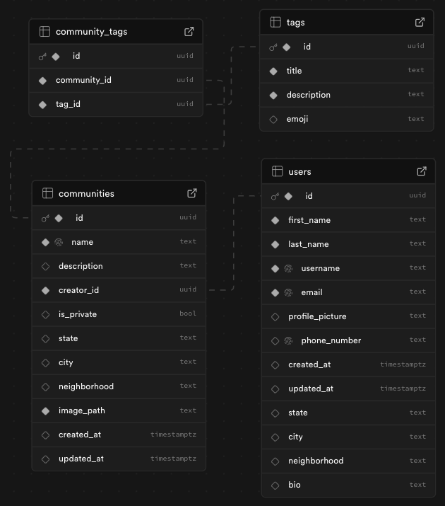

# 🧪 Desafio Técnico – Engenheiro(a) de Software | Praça

Bem-vindo(a) ao nosso desafio técnico! 💚  
Este desafio simula uma tarefa real que você poderia receber aqui na **Praça**, e foi pensado para avaliar sua habilidade em construir uma nova funcionalidade do zero com qualidade e clareza.

Nosso objetivo é entender como você estrutura e implementa uma nova funcionalidade dentro de um projeto já existente, utilizando as ferramentas que fazem parte do nosso stack.

## 🎯 O Desafio: Tela de Explorar

A praça é a rede social que permite gestores de comunidade viverem de seus sonhos construindo suas praças e aos usuários de encontrarem as experiências perfeitas para viverem mais a vida real. Encontrar uma praça para fazer parte significa participar de eventos, sair com os amigos, ter a possibilidade de conhecer novas experiências e criar memórias.
Olhando o futuro do mercado de trabalho e a evolução das tecnologias teremos menos rotinas operacionais e uma redução na carga de trabalho, então nossa solução visa trazer mais significado para a vida das pessoas com atividades que elas amam.
Dessa forma explorar novas experiências é uma das etapas dessa jornada pelas praças. Por que não a turma que joga o futebol toda semana de quarta-feira não se interessaria por jogar altinha no parque aos sábados?
O início da tela de explorar é segmentar por categorias (tabela tags), quando filtrar pela categoria de "futebol" ver tanto a praça do fut society de quarta quanto a altinha no parque de sábado. Assim, iniciaremos com nomes e categorias para uma base de praças.

Você irá desenvolver uma nova página chamada `/explorar`, acessível a partir da página inicial do site.

Essa tela permitirá aos usuários:
- Buscar praças pelo nome
- Aplicar filtros que ajudem a refinar os resultados
- Visualizar uma lista de praças com base nos critérios escolhidos

Além disso, você receberá:
- Um **projeto base com Next.js, Tailwind CSS e TypeScript** configurado e uma página inicial simples (`/`)
- Um **template básico da tela de explorar**, já com estrutura inicial e layout mínimo
- Um **client do Supabase** já conectado a um projeto com as tabelas necessárias e RLS configurado
- **Telas criadas pela nossa designer**, com o UI e UX que esperamos para a funcionalidade

📸 **As telas de UI/UX estarão disponíveis neste link:**  
_(_placeholder para link do Figma ou visualização_)_

## 🛠️ Stack utilizada

- [Next.js](https://nextjs.org/) (App Router)
- [TypeScript](https://www.typescriptlang.org/)
- [React](https://reactjs.org/)
- [Tailwind CSS](https://tailwindcss.com/)
- [Supabase](https://supabase.com/)

## 📚 Estrutura do Banco de Dados

Este projeto já vem com um banco de dados Supabase configurado e populado com dados fictícios. Você poderá ler e consultar os dados, mas **não será possível alterá-los**, pois as permissões estão limitadas a `SELECT`.

📸 **Visualização do modelo de dados:**  

### 🔸 Tabelas disponíveis

- **users**
- **communities**
- **tags**
- **community_tags**

### 🧍‍♂️ `users`

Guarda informações dos criadores de praças.

| Campo            | Tipo        | Descrição                                   |
|------------------|-------------|---------------------------------------------|
| `id`             | UUID        | Identificador único (igual ao `auth.uid()`) |
| `first_name`     | TEXT        | Primeiro nome do usuário                    |
| `last_name`      | TEXT        | Último nome do usuário                      |
| `username`       | TEXT        | Nome de usuário único                       |
| `email`          | TEXT        | Email único                                 |
| `profile_picture`| TEXT        | URL da foto de perfil                       |
| `phone_number`   | TEXT        | Número de telefone                          |
| `bio`            | TEXT        | Biografia curta do usuário                  |
| `state`          | TEXT        | Estado                                      |
| `city`           | TEXT        | Cidade                                      |
| `neighborhood`   | TEXT        | Bairro                                      |
| `created_at`     | TIMESTAMPTZ | Data de criação                             |
| `updated_at`     | TIMESTAMPTZ | Data de atualização                         |

📄 CSV: [`users.csv`](./praca-desafio/public/databases/users.csv)

### 🏡 `communities`

Representa uma praça criada por um usuário.

| Campo          | Tipo        | Descrição                                |
|----------------|-------------|------------------------------------------|
| `id`           | UUID        | Identificador único                      |
| `name`         | TEXT        | Nome da praça                            |
| `description`  | TEXT        | Descrição da praça                       |
| `creator_id`   | UUID        | Referência a `users.id`                  |
| `is_private`   | BOOLEAN     | Indica se a praça é privada              |
| `state`        | TEXT        | Estado onde a praça está localizada      |
| `city`         | TEXT        | Cidade onde a praça está localizada      |
| `neighborhood` | TEXT        | Bairro onde a praça está localizada      |
| `image_path`   | TEXT        | Caminho da imagem da praça               |
| `created_at`   | TIMESTAMPTZ | Data de criação                          |
| `updated_at`   | TIMESTAMPTZ | Última atualização                       |

📄 CSV: [`communities.csv`](./praca-desafio/public/databases/communities.csv)

### 🏷️ `tags`

Tags representam interesses que podem estar associados às praças.

| Campo         | Tipo | Descrição                          |
|---------------|------|------------------------------------|
| `id`          | UUID | Identificador único                |
| `title`       | TEXT | Nome da tag (ex: Yoga, Leitura)    |
| `description` | TEXT | Descrição da tag                   |
| `emoji`       | TEXT | Emoji representando a tag          |

📄 CSV: [`tags.csv`](./praca-desafio/public/databases/tags.csv)

### 🔗 `community_tags`

Tabela de junção entre `communities` e `tags`.

| Campo          | Tipo | Descrição                                       |
|----------------|------|-------------------------------------------------|
| `id`           | UUID | Identificador único                             |
| `community_id` | UUID | Referência à tabela `communities(id)`           |
| `tag_id`       | UUID | Referência à tabela `tags(id)`                  |

📄 CSV: [`community_tags.csv`](./praca-desafio/public/databases/community_tags.csv)

### 🔄 Relacionamentos

- Um usuário (`users`) pode criar várias praças (`communities`)
- Uma praça pode ter múltiplos interesses (`tags`)
- Uma tag pode estar associada a várias praças
- A tabela `community_tags` representa essa associação N:N entre `communities` e `tags`

### 🖼️ Buckets de Imagens

As imagens usadas neste projeto estão armazenadas em buckets públicos no Supabase:

- **Fotos de perfil de usuários:**  
  `profile-pictures/<user_id>`

- **Imagens das praças (communities):**  
  `praca-pictures/<creator_id>`

Esses caminhos são utilizados nas colunas `profile_picture` e `image_path` das respectivas tabelas.

### 🧷 Tags atribuídas às Praças

As praças possuem **interesses (tags)** associados. Essa relação é usada para implementar os filtros por interesse na tela de explorar.

| Comunidade                       | Tags                                                                 |
|----------------------------------|----------------------------------------------------------------------|
| Mestres do Código                | Tecnologia, Ciências                                                 |
| Amantes da Música                | Ar livre, Ir com a galera, Música                                    |
| Moda Sustentável                 | Moda, Causas Sociais                                                 |
| Cervejeiros Artesanais           | Restaurantes, Gastronomia, Ir com a galera, Relaxando                |
| Comunidade de Cinema de Rua      | Ar livre, Cinema, Teatro, Relaxando                                  |
| Fotografia Urbana BH             | Ar livre, Artes, Turismo                                             |
| Clube dos Games                  | Jogos                                                                |
| Futebol de Várzea Gameleira      | Futebol, Ar livre, Esportes, Para os moleques, Para as divas         |
| Feiras Locais de BH              | Ar livre, Gastronomia                                                |
| Boardgames & Amigos              | Jogos                                                                |
| Apaixonados pelo Ciclismo Urbano | Esportes, Ar livre                                                   |
| Clube de Leitura Savassi         | Para as Divas, Artes, Relaxando                                      |
| Yoga ao Ar livre                 | Ar livre, Yoga, Relaxando                                            |
| Grupo Café & Conversa            | Restaurantes, Gastronomia, Ir com a galera                           |
| Chefs Caseiros BH                | Culinária, Gastronomia                                               |
| Jardilovers                      | Ar livre, Relaxando, Causas Sociais                                  |
| Pais de Pet Santo Agostinho      | Ar livre, Ir com a galera                                            |
| Turismo em BH                    | Turismo, Causas Sociais, Artes                                       |
| Amantes de Bicicletada Kids      | Esportes, Ar livre                                                   |
| Arte & Pintura BH                | Artes                                                                |

## ✅ O que deve ser feito

### 🗺️ Overview das tarefas
Durante este desafio, você deverá:

- Implementar a **query inicial de praças** na tela de explorar
- Adicionar a funcionalidade de **busca por nome da praça**
- **Criar componentes** com base na UI fornecida (como o `PracaCard`)
- Implementar a lógica para **filtrar praças por interesses**
- **Responder perguntas** no arquivo `Perguntas.md`

### 🔍 Detalhes das funcionalidades

#### 1. Implementar query de praças default
Ao acessar a tela `/explorar`, o sistema deve carregar todas as praças disponíveis, ordenadas da **mais nova para a mais antiga**.

Cada praça deve ser exibida utilizando o componente `PracaCard`, que você deverá criar. Esse card deve apresentar:

- Nome da praça
- Foto da praça
- Foto do criador da praça
- Localização da praça (cidade ou bairro, conforme definido na UI)

#### 2. Buscar praças pelo nome
Utilize a search bar já incluída no código base e implemente a funcionalidade de busca.

A lista de praças deve ser atualizada em tempo real conforme o usuário digita.  
Caso nenhum resultado seja encontrado, exiba um **Empty State** com a mensagem:  
**"Não há Praças com essas características."**

#### 3. Criar UI de componentes que não foram implementados
Alguns componentes mencionados no UI design não estão implementados no código base. É necessário criá-los a partir do zero, com base na UI fornecida.

Exemplos de componentes a serem criados:
- `PracaCard`
- Modal de filtros (para selecionar interesses)
- Outros que sejam identificados durante a implementação

#### 4. Filtro por interesse
Implemente a lógica para permitir ao usuário selecionar um ou mais **interesses** (tags) e filtrar a lista de praças.

A regra de negócio é:
- Apenas praças que possuam **TODOS os interesses selecionados** devem aparecer.
- Se nenhum resultado for encontrado, exiba o mesmo **Empty State** com a mensagem:  
**"Não há Praças com essas características."**

#### 5. Responder às perguntas no arquivo `Perguntas.md`
No projeto existe um arquivo chamado `Perguntas.md`, com perguntas que nos ajudam a entender melhor seu raciocínio, decisões técnicas e uso de ferramentas (como AI).

Por favor, responda esse arquivo e inclua suas respostas no commit final da sua entrega.

### ✨ Funcionalidades extras (opcional)

Estas funcionalidades **não são obrigatórias**, mas irão agregar muito valor à sua entrega:

- **Criar loading states** para a tela de explorar e outros componentes relevantes:  
  Loading states são uma melhoria significativa para a experiência do usuário, e o Next.js oferece suporte nativo a isso por meio dos arquivos `loading.tsx`  
  📄 [Documentação oficial do Next.js](https://nextjs.org/docs/app/api-reference/file-conventions/loading)

  Você pode implementar desde loaders simples (spinners) até **skeletons** inspirados na UI fornecida.  
  Esse cuidado contribui bastante para a fluidez da interface e para a percepção de qualidade do produto.

- **Animação sutil em botões interativos**  
  Aplicar transições suaves em botões e elementos clicáveis (ex: filtros, cards) para indicar que uma ação foi realizada.  
  Um leve `scale` ou `opacity` com Tailwind pode fazer toda a diferença na experiência.

- **Responsividade com foco em dispositivos mobile**  
  Garantir que a tela de explorar funcione perfeitamente em smartphones, com layouts ajustados, scroll comportado e boa legibilidade.

- **Botão de “Limpar filtros”**  
  Adicionar uma forma rápida e clara de remover todos os filtros aplicados com um clique.  
  Essa funcionalidade é muito útil para usuários que querem redefinir a busca.

### 🧠 Deixe sua imaginação fluir!

Você identificou alguma melhoria que poderia tornar a experiência do usuário ainda melhor nesta tela?  
Sinta-se à vontade para implementá-la — e conte pra gente na sua resposta à **pergunta 1** no arquivo `Perguntas.md`.

## 🧪 Critérios de Avaliação

Não buscamos apenas funcionalidades que "funcionam", mas também **como** elas são construídas.

Os critérios de avaliação incluem:

- ✨ **Qualidade da implementação da UI**  
  A interface deve seguir de perto a UI fornecida pela nossa designer.

- 🧼 **Organização e clareza do código**  
  Código bem estruturado, componentes claros, nomes consistentes e responsabilidade bem separada.

- 📝 **Documentação e explicações**  
  Respostas no arquivo `Perguntas.md`, comentários relevantes no código, e clareza geral de comunicação.

- 🧠 **Decisões técnicas bem fundamentadas**  
  Avaliamos se suas escolhas (arquitetura, separação de lógica, uso de bibliotecas) fazem sentido e são bem justificadas.

- ⚙️ **Corretude e robustez da solução**  
  O sistema funciona como esperado nos casos principais? Foram tratados casos como lista vazia, inputs inválidos, estados intermediários?

- 📱 **Responsividade e experiência mobile**  
  A tela é usável e visualmente agradável em dispositivos móveis.

## ⏱️ Tempo e entrega

- Estimamos que o desafio leve entre **4 a 10 horas** para ser concluído
- A entrega deve ser feita em **até 5 dias úteis**

## 🧠 Dica sobre uso de AI

Você está **liberado(a)** para usar ferramentas como ChatGPT, Copilot ou outras que aumentem sua produtividade.  
Se quiser, conte pra gente como você usou AI durante o desafio — será legal ver como você integra essas ferramentas no dia a dia.

## 🤝 Dúvidas?

Se tiver qualquer dúvida, você pode mandar um email para **apracadev@gmail.com** ou falar com a gente no WhatsApp: **+55 11 93029-7335**

Boa sorte e divirta-se no desafio! 💚  
**Time da Praça**
